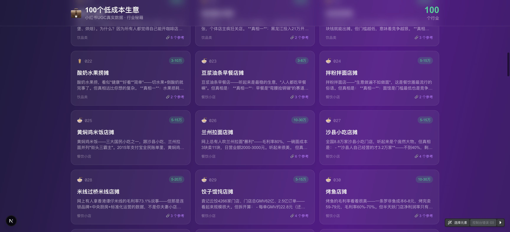

# 💼 100个低成本生意 — 行业秘籍

> 基于小红书UGC真实数据，用大白话告诉你每个行业的真相、成本、避坑指南。



## 🎯 项目简介

100个低成本创业行业的深度调研报告，每个行业包含：
- 🔍 **research.md** — 小红书博主笔记+评论区UGC原始数据
- 📝 **summary.md** — 大白话行业秘籍（张雪峰风格），11个章节

所有数据来自小红书真实用户分享，不是网上那些复制粘贴的废话。

## 📊 行业分类

| 类别 | 数量 | 代表行业 | 启动资金范围 |
|------|------|----------|-------------|
| 🍡 街边小吃摆摊 | 15 | 煎饼果子、炸串、烤冷面 | 0.2-3万 |
| 🧋 饮品类 | 7 | 奶茶店、柠檬茶、咖啡 | 0.3-30万 |
| 🍜 餐饮小店 | 16 | 黄焖鸡、螺蛳粉、小火锅 | 3-50万 |
| 🧹 生活服务 | 10 | 家政保洁、快递驿站、洗车 | 1-20万 |
| 🛒 零售电商 | 7 | 便利店、水果店、社区团购 | 0.5-50万 |
| 💅 美容健康 | 10 | 美甲店、足疗店、艾灸馆 | 3-50万 |
| 📱 线上自媒体 | 11 | 短视频带货、直播带货、AI工具代做 | 0-5万 |
| 📚 教育培训 | 6 | 托管班、少儿编程、舞蹈培训 | 2-30万 |
| 🚗 汽车出行 | 7 | 汽车贴膜、二手车、代驾 | 0-50万 |
| 🎨 手工创意 | 4 | 手工蛋糕、DIY手工坊 | 0.5-10万 |
| 🏪 社区便民 | 6 | 自习室、剧本杀、台球室 | 5-50万 |

## 🌐 Web App

基于 Next.js 的交互式展示页面：

```bash
cd 100-biz-guide
npm install
npm run dev
```

功能：
- ✅ 按类别筛选行业
- ✅ 搜索行业名称
- ✅ 每个行业详情页（完整summary + 🔗参考链接）
- ✅ 统计面板

## 📖 每个行业的 summary.md 包含11个章节

1. **真相** — 小红书上干过的人说了什么
2. **成本** — 这笔账到底怎么算
3. **启动** — 要花多少钱
4. **选址** — 决定了你80%的收入
5. **手艺** — 行业命门是什么
6. **作息** — 每天的真实状态
7. **潜规则** — 行业内幕
8. **避坑** — 必须避开的坑
9. **趋势** — 行业信号
10. **进阶** — 从新手到老手的路线
11. **结尾** — 一句最重要的话

## 📁 项目结构

```
businesses/
├── 001_煎饼果子摊/
│   ├── research.md    # 调研原始数据
│   └── summary.md     # 行业秘籍总结
├── 002_烤红薯烤玉米摊/
│   ├── research.md
│   ├── summary.md
├── ... (100个行业)
├── 100_自习室/
│   ├── research.md
│   ├── summary.md

100-biz-guide/          # Next.js Web App
├── src/
│   ├── app/
│   │   ├── page.tsx          # 首页
│   │   └── business/[id]/    # 详情页
│   └── data/
│       └── businesses.json   # 行业数据
├── scripts/
│   └── extract-data.js       # 数据提取脚本
```

## 🔗 数据来源

所有调研数据来自小红书UGC内容：
- 博主笔记正文
- 评论区真实对话
- 每条笔记都附带 🔗 可点击超链接，方便用户查看原始内容

## ⚠️ 免责声明

- 所有数据仅供参考，实际经营情况因地域、个人能力等因素差异巨大
- 小红书UGC数据存在幸存者偏差，成功案例曝光率高，失败案例往往沉默
- 创业有风险，入市需谨慎

## 📜 License

MIT